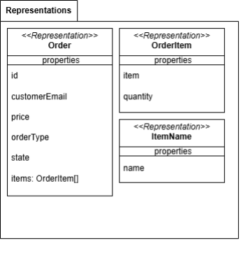
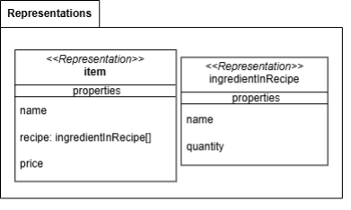

# Building blocks
// TODO introduction

## Orders
// TODO introduction  

## Menu
// TODO introduction  

## Warehouse
// TODO introduction  

## Building blocks classification
* **Customer contact**: Value Object
* **Warehouse**: Repository
* **Menu**: Repository
* **Item**: Entity
* **Recipe**: Value Object
* **Ingredient**: Entity
* **Order**: Entity
* **Order Type**: Value Object
  * At the table
  * Take away
  * Home delivery
* **Restock**: Domain Event
* **Change order status**: Domain Event
* **Order status**: Value Object
  * Order completed
  * Order ready
  * Order pending
* **Available item**: Service
* **Available ingredient**: Service

## Building blocks reletionship
// TODO introduction  

