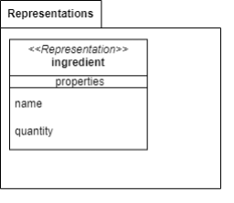

# Building blocks

## Entity and value object schemas
* Orders

* Menu

* Warehouse

## Building blocks classification
* **Customer contact**: Value Object
* **Warehouse**: Repository
* **Menu**: Repository
* **Item**: Entity
* **Recipe**: Value Object
* **Ingredient**: Entity
* **Orders**: Repository
* **Order**: Entity
* **Order Type**: Value Object
  * At the table
  * Take away
  * Home delivery
* **Change order status**: Domain Event
* **Create new order**: Domain event
* **Order status**: Value Object
  * Order completed
  * Order ready
  * Order pending

## Services
|Functionality|Description|Parameters|Output|
|-|-|-|-|
|CREATE_ORDER|When a new order is sent from the customer, it is checked if all the needed ingredients by the item recipe are present in the warehouse and then it is created. After that all the used ingredients are removed from the warehouse, and in case an ingredient became missing it's sent a notification to the manager application. At the end, a notification is sent to the customer application to notify that the order has been created|new order|created new order and notification|
|GET_ORDER_BY_ID|It gets an order given its id|id of the order|collected order|
|PUT_ORDER|It collect the order that has to be modified and updates it. After that it returns all the orders. When an *take away* order or a *home delivery* order becomes ready it is sent an email|updated information of the order|all the orders|
|GET_ALL_ORDERS|It gets all the orders||all the orders|
|CREATE_ITEM|It creates a new item|new item|new item|
|GET_ITEMS|It gets all the item||all the items|
|UPDATE_ITEM|It updates an item|updated information of the item|updated item|
|GET_AVAILABLE_ITEMS|It gets all the items made by ingredients that are available in the warehouse|available ingredients names|all the available ingredients|
|GET_ITEM_BY_NAME|It gets an item given its name|name of the item|collected item|
|CREATE_INGREDIENT|It creates a new ingredient|new ingredient|new ingredient|
|DECREASE_INGREDIENTS_QUANTITY|It decrease the quantity of a list of given ingredients|list of ingredient and quantity to decrease|all the ingredients|
|GET_ALL_AVAILABLE_INGREDIENT|It gets all the ingredients that have quantity greater than 0||all the available ingredients|
|GET_ALL_INGREDIENT|It gets all the ingredients||all the ingredients|
|RESTOCK|Restock the quantity of an ingredient|name of the ingredient and the quantity to restock|all the ingredients|

## Building blocks relationship

